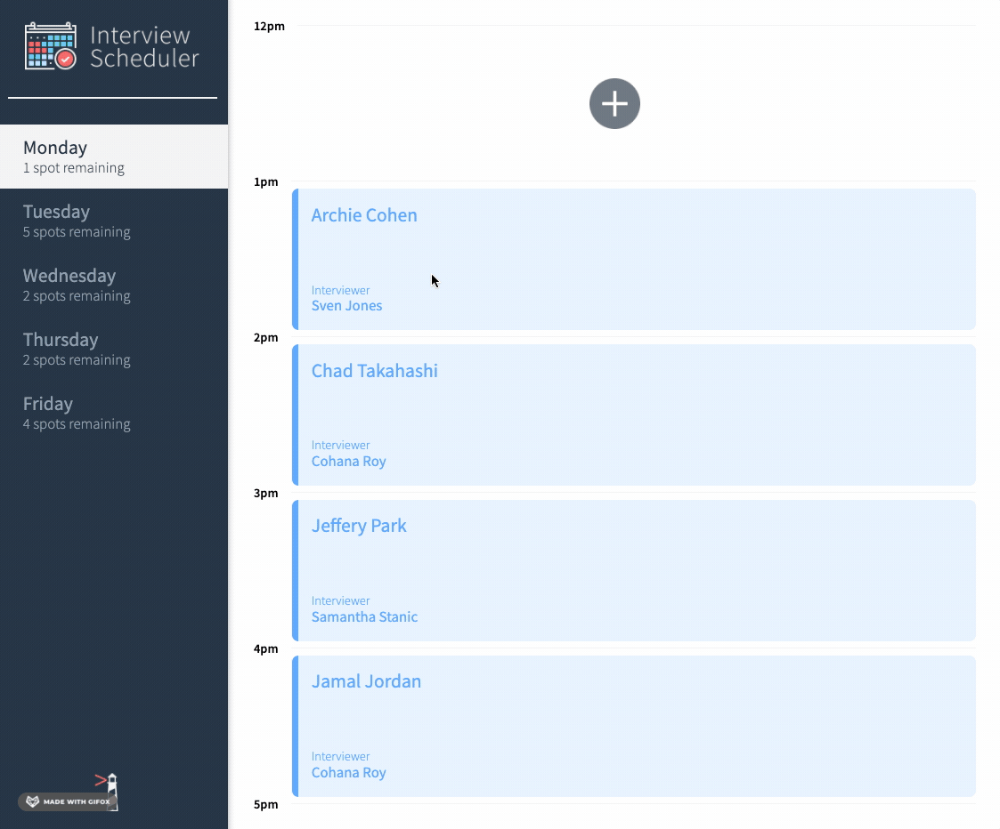
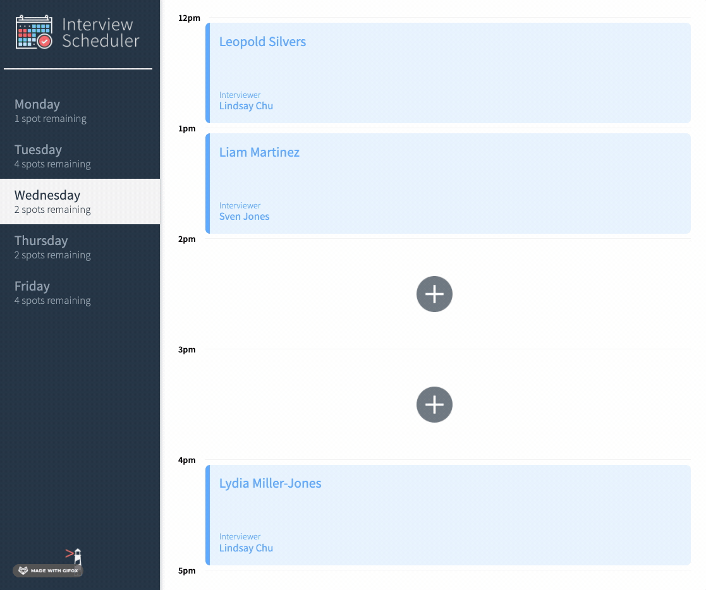
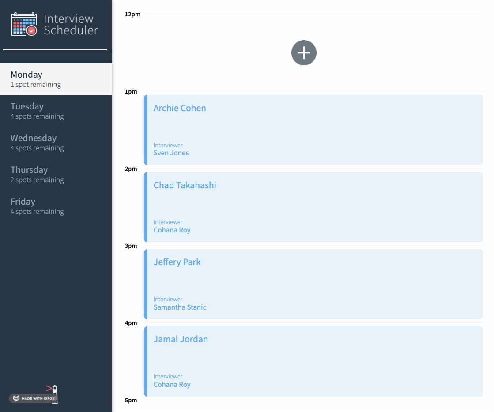

# Interview Scheduler

## Setup

Install dependencies with `npm install`.

## Running Webpack Development Server

```sh
npm start
```

## Running Jest Test Framework

```sh
npm test
```

## Running Storybook Visual Testbed

```sh
npm run storybook
```

## App Demo

### Creating a new appointment


### Editing an existing appointment


### Deleting an existing appointment


### Error handling for failure to create/edit/delete appointment


